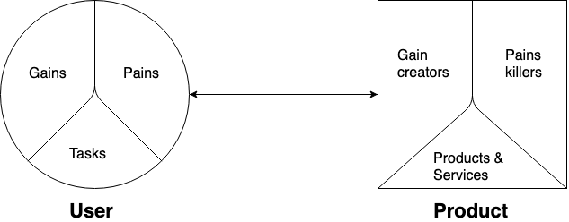

# Web Design @cmda-minor-web 1819
## Concept 🧩
De kern van het concept is dat ik voor alle (betekenisvolle) elementen op de website een hover event heb toegevoegd.
Afhankelijk van welk evenement het is speelt de website een verschillend geluid af. Ook klinkt er een 'error' geluid wanneer
de gebruiker met de muis buiten het 'window' van de website gaat. Larissa kan een uitleg krijgen van wat elk geluid betekent.
Door met tab naar een link te gaan die linkt naar de uitleg. Wanneer Larissa over een element hovert en op de <key>ALT</key> toets 
drukt leest haar screenreader voor wat het element is en wat de inhoud/functie van het element is. 

## Onderzoek 🔍
### User Scenario
#### Wie? 👩
Larissa: Larissa is blind. Bij het bezoeken van websites op internet maakt ze gebruik van een brailleregel, en van een screenreader.
Ze heeft veel ervaring met haar screenreader en brailleregel, dus kan ik in mijn ontwerp rekening houden met het feit dat ze bekend
is met huidige technologieën.
#### Wat? (opdracht) 
Larissa wil op een website snel en effectief kunnen navigeren. Op dit moment doet ze dit met behulp van een screenreader 
en een brailleregel. Door bepaalde sneltoetsen te gebruiken kan ze bijvoorbeeld: snel door alle linkjes op de pagina tabben.
Ook kan ze elementen opvragen die op de pagina te vinden zijn. Zoals alle titels of alle alt-teksten.

__Hoe__ ontwerp ik een website waardoor Larissa makkelijk, snel, effectief en ook 'pleasurable' kan navigeren.

#### (mogelijke) Oplossingen ☑
* __Auditief navigeren__ Alle elementen op de pagina spelen een geluid af wanneer de muis hier overheen hovert. Dit geluid 
is kenmerkend voor het element, zodat Larissa herkent welke elementen het zijn. Wanneer ze een **trackpad** gebruikt 
kan ze tactiel voelen waar de randen van de viewport zijn, doordat de grote van de viewport wordt vertaald naar het trackpad.
Dus rechtsboven op het trackpad is ook rechtsboven op de website, linksonder is ook linksonder op de website enz.

* __'Dedicated' navigatie pagina__ Op dit moment 'tabbed' -> <kbd>TAB</kbd> Larrissa door de websites heen om te navigeren.
Dit werkt best goed, totdat je op een website komt zoals [bol.com](https://www.bol.com/nl/), waar je producten kunt vinden door 
het menu te gebruiken. Dit menu is immens groot, wat voor mensen die kunnen zien al een kleine uitdaging kan vormen, voor mensen 
die blind zijn is dit een nog grotere uitdaging. Larissa gaf aan dat ze soms niet meer weet waar ze is op websites. Daarom 
is het handig als er een pagina is waar je met tab als een soort boomstructuur door het menu kunt tabben. Deze pagina is een
extra laag bovenop de huidige website. Deze is alleen toegankelijk via een 'skip-link'. Deze link kun je alleen bezoeken 
wanneer je de <kbd>TAB</kbd> toets gebruikt. Mensen die niet blind zijn zullen hier dus niks van merken.

### Value Proposition Canvas

    
#### User 👩🏻‍🦰
* Tasks
    * Larissa gebruikt het menu om door de website te navigeren
    * Larissa zoekt naar informatie over specifieke producten/onderwerpen op een detailpagina van de website.
    
* Gains
    * Larissa kan met een 'goede' navigatie informatie vinden op websites.
    * Larissa weet waar ze is op de website.
    * Ze kan terug en vooruit op de pagina (navigeren).
    * Met haar screen-reader weet Larissa wat er op de website te vinden is.

* Pains
    * Larissa weet vaak niet waar ze is op een website.
    * Larissa kan websites soms niet gebruiken, omdat de focus op sommige elementen disabled is. 
    * Sommige ontworpen interacties die vanzelfsprekend zijn voor niet blinde mensen. Zijn voor Larissa onmoglijk om te 
    gebruiken. Zoals de 'regen-slider' van [buienradar](https://www.buienradar.nl/).
    * Afhankelijk van de website kan het erg lang duren voordat Larissa weet welke elementen er allemaal op een website te vinden
    zijn.
    
#### Product 🎁
* Products & Services
    * (Dedicated navigatie pagina)
    * **Auditief navigeren**

* Gain creators
    * (Larissa kan snel vinden wat ze zoekt.)
    * (Effectief zoeken, dus ze kan doelgericht zonder omwegen vinden wat ze zoekt.)
    * (Larissa weet snel waar ze is op de website.)
    * **Larissa weet sneller welke elementen er op de website zijn en waar ze zich bevinen.**
    * **Larissa kan een website bijna op dezelfde manier ervaren zoals mensen die wel kunnen zien een website ervaren.**
    
* Pain killers
    * (Breadcrumbs zorgen ervoor dat ze ten alle tijden weet waar ze is op de website.)
    * (De HTML is semantisch, waardoor de screen-reader de website juist interpreteert.)             
    * **De interactie op de website werkt intuïtief voor Larissa.** 
    * **Larissa kan horen welke elementen er op de website zijn**
    * **Larissa weet zelfs waar de elementen zich bevinden op de website, en waar de elementen zich relatief van elkaar bevinden.**
    
### Exclusive Design
#### Study Situation
Larissa gebruikt, ondanks dat ze (bijna) helemaal blind is, veel moderne technologie. Zoals: Laptop, Iphone, Ipad. Ze heeft 
geleerd hoe ze m.b.v. een screenreader en een brailleregel deze apparaten kan gebruiken. Haar smartphone vindt ze het fijnst 
om te gebruiken. Omdat ze met haar vinger over de website kan gaan en de screen reader leest voor waar ze over heen "hovert".

#### Ignore conventions
In mijn concept ben ik op zoek gegaan naar iets "geks", iets onconventioneels. Ik kwam met het idee om met de muis over de 
website te 'hoveren' en dat de verschillende elementen geluiden maken waardoor Larissa weet waar ze op de website is en welke
elementen het zijn. Dit wordt onderbouwd door het feit dat Larissa het fijn vindt om met haar smartphone over een website te hoveren
en dat haar screenreader voorleest waar ze is. 

#### Prioritise Identity
Zelf had ik het vooroordeel dat Larissa niet te veel geluiden op de website zou willen omdat het anders net een kermis wordt.
Maar Larissa gaf bij de 1e test met mijn product aan dat ze juist meer geluiden wilt en dat ze ook wat harder mogen. 
Zo kom je er achter dat je vooroordelen vaak niet kloppen, met wat de gebruiker echt wil.   

#### Add Nonsense
Het feit dat Larissa met dit concept de website kan 'horen', net zoals mensen met goed zicht een website kunnen 'zien' 
komt door een combinatie van functioneel en 'Add Nonsense'. De geluiden zijn heel gek maar tegelijk ook heel functioneel voor
Larissa. Dus de Nonsense die ik heb toegevoegd is eigenlijk functioneel geworden voor Larissa. 

### User Tests

#### Week 1
Bij de eerste test hebben we kennis gemaakt met Larissa en zijn we te weten gekomen hoe ze met technologie omgaat. Zoals
haar screenreader en de brailleregel. Ook dat ze verschillende apparaten gebruikt zoals: Macbook, windows laptop, Iphone en een Ipad.

#### Week 2
In week 1 moedigde Larissa ons aan om vooral gek te denken en met onconventionele concepten te komen. Dit heeft me geïnspireerd
om mijn concept bij haar te testen. Dit beviel haar erg goed, ze had nog nooit eerder op zo'n manier door een website genavigeerd.
De verbeter punten waren: 
* Het error geluid wanneer de muis uit de 'window' gaat speelt alleen af wanneer de muis echt compleet buiten het window is..
Dus moest de browser geresized worden om het te laten werken. Het zou beter zijn als dit geluid wordt afgespeeld als de muis 
de rand van de website raakt. 
* Er mogen meer geluiden worden toegevoegd, sommige geluiden mogen ook harder worden afgespeeld. 
* Het zou handig zijn als ze haar screenreader kan laten vertellen wat er in het element staat waar ze overheen hovert. 

#### Week 3
Alle verbeterpunten heb ik in de laatste itteratieslag verwerkt. 
* Wanneer de muis de rand van de website raakt speelt het error geluid zich af. 
* Er zijn meer geluiden toegevoegd, zodat elk elementen wat betekenisvol is een uniek kenmerkend geluid maakt. 
* Door gebruik te maken van een ARIA Live Region leest haar screenreader voor wat er in het element staat waar ze overheen
hovert.

